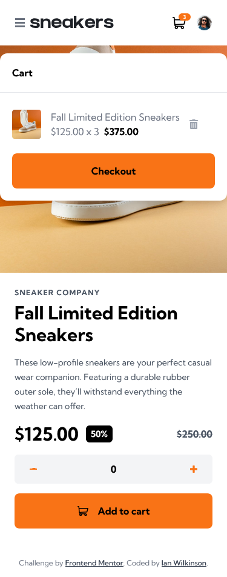
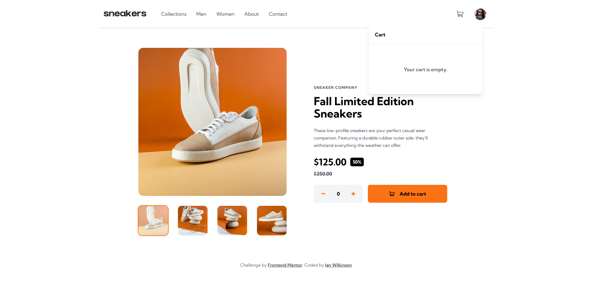

# Frontend Mentor - E-commerce product page solution

This is a solution to the [E-commerce product page challenge on Frontend Mentor](https://www.frontendmentor.io/challenges/ecommerce-product-page-UPsZ9MJp6). Frontend Mentor challenges help you improve your coding skills by building realistic projects.

## Table of contents

- [Overview](#overview)
  - [The challenge](#the-challenge)
  - [Screenshot](#screenshot)
  - [Links](#links)
- [My process](#my-process)
  - [Built with](#built-with)
  - [What I learned](#what-i-learned)
  - [Continued development](#continued-development)
  - [Useful resources](#useful-resources)

## Overview

### The challenge

Users should be able to:

- View the optimal layout for the site depending on their device's screen size
- See hover states for all interactive elements on the page
- Open a lightbox gallery by clicking on the large product image
- Switch the large product image by clicking on the small thumbnail images
- Add items to the cart
- View the cart and remove items from it

### Screenshot

Mobile:




Desktop:




### Links

- [Solution URL](https://github.com/ianwilk20/ecommerce-product-page)
- [Live Site URL](https://ecom-sneaker-app-ianwilk20.netlify.app/)

## My process

### Built with

- Semantic HTML5 markup
- CSS custom properties
- Flexbox
- Mobile-first workflow
- [Tailwind](https://tailwindcss.com/docs) - For styles
- [React](https://reactjs.org/) - JS library

### What I learned

How to resize svg's. I found that if you have an svg file with a defined width and height, simply changing those values won't necessarily resize the svg; sometimes, it will cut off part of the svg. If you try to use the css property `transform: scale(0.8)` it can cause some weirdness as the transformed svg image parent element won't be aware of the increased sizing of the svg element. One way to resize an svg I found, which may be flawed but seemed to work, is to remove the predefined width and height and use those two numbers as the last two numbers in a viewBox property on the svg. Then, add a width and height CSS style to the svg and you'll have a resizing svg.

Ex. Before
```CSS
<svg width="22" height="20" xmlns="http://www.w3.org/2000/svg"><path d="M20.925 3.641H3.863L3.61.816A.896.896 0 0 0 2.717 0H.897a.896.896 0 1 0 0 1.792h1l1.031 11.483c.073.828.52 1.726 1.291 2.336C2.83 17.385 4.099 20 6.359 20c1.875 0 3.197-1.87 2.554-3.642h4.905c-.642 1.77.677 3.642 2.555 3.642a2.72 2.72 0 0 0 2.717-2.717 2.72 2.72 0 0 0-2.717-2.717H6.365c-.681 0-1.274-.41-1.53-1.009l14.321-.842a.896.896 0 0 0 .817-.677l1.821-7.283a.897.897 0 0 0-.87-1.114ZM6.358 18.208a.926.926 0 0 1 0-1.85.926.926 0 0 1 0 1.85Zm10.015 0a.926.926 0 0 1 0-1.85.926.926 0 0 1 0 1.85Zm2.021-7.243-13.8.81-.57-6.341h15.753l-1.383 5.53Z" fill="#69707D" fill-rule="nonzero"/></svg>
```

Ex. Add the view box with the width and height as the last two numbers in the view box
```CSS
<svg viewBox="0 0 22 20" xmlns="http://www.w3.org/2000/svg"><path d="M20.925 3.641H3.863L3.61.816A.896.896 0 0 0 2.717 0H.897a.896.896 0 1 0 0 1.792h1l1.031 11.483c.073.828.52 1.726 1.291 2.336C2.83 17.385 4.099 20 6.359 20c1.875 0 3.197-1.87 2.554-3.642h4.905c-.642 1.77.677 3.642 2.555 3.642a2.72 2.72 0 0 0 2.717-2.717 2.72 2.72 0 0 0-2.717-2.717H6.365c-.681 0-1.274-.41-1.53-1.009l14.321-.842a.896.896 0 0 0 .817-.677l1.821-7.283a.897.897 0 0 0-.87-1.114ZM6.358 18.208a.926.926 0 0 1 0-1.85.926.926 0 0 1 0 1.85Zm10.015 0a.926.926 0 0 1 0-1.85.926.926 0 0 1 0 1.85Zm2.021-7.243-13.8.81-.57-6.341h15.753l-1.383 5.53Z" fill="#69707D" fill-rule="nonzero"/></svg>
```

Ex. Add a width and height css class to resize the svg
```CSS
<svg viewBox="0 0 22 20" className="w-[10px] h-[10px]" xmlns="http://www.w3.org/2000/svg"><path d="M20.925 3.641H3.863L3.61.816A.896.896 0 0 0 2.717 0H.897a.896.896 0 1 0 0 1.792h1l1.031 11.483c.073.828.52 1.726 1.291 2.336C2.83 17.385 4.099 20 6.359 20c1.875 0 3.197-1.87 2.554-3.642h4.905c-.642 1.77.677 3.642 2.555 3.642a2.72 2.72 0 0 0 2.717-2.717 2.72 2.72 0 0 0-2.717-2.717H6.365c-.681 0-1.274-.41-1.53-1.009l14.321-.842a.896.896 0 0 0 .817-.677l1.821-7.283a.897.897 0 0 0-.87-1.114ZM6.358 18.208a.926.926 0 0 1 0-1.85.926.926 0 0 1 0 1.85Zm10.015 0a.926.926 0 0 1 0-1.85.926.926 0 0 1 0 1.85Zm2.021-7.243-13.8.81-.57-6.341h15.753l-1.383 5.53Z" fill="#69707D" fill-rule="nonzero"/></svg>
```

Tailwind doesn't allow for dynamic styling ex. Setting the height of an element based on the size of the document's height. To accomplish this in React, use the style property on the html element. The downside of this is that if the page is resized, the mobile menu will not grow and shrink in height. That's something I'd have to look into how to do.
 Ex. 
 ```jsx
  <section
      className="absolute w-full z-10"
      style={{ height: document.documentElement.scrollHeight }}
  >
  ...content
  </section>
 ```

### Continued development

I would've liked to apply better apply the principle of making components "dumb". For example, the ProductImage component was first build for mobile, then I added responsivity for desktop and removed the left and right arrow buttons as per mockup. Then, designing the lightbox component I saw a chance to reuse the ProductImage component, but that came at a cost of the adding specific functionality for the lightbox inside of the component to allow me to reuse it. Getting those two components to work together took the longest time ie. When the user clicks on the main image on the product page (that uses the ProductImage), the Lightbox component opens up with the ProductImage component, and ensuring that the main image that was clicked on the product page is what is first opened in the Lightbox. After getting it working, I refactored the ProductImage component quite a bit so that it could be as reusable as possible and so that it doesn't need to know about the Lightbox component. It probably isn't the cleanest or best implementation but it works and given more time I could probably improve it further.

### Useful resources

- [PedroTech - Designing React Components](https://www.youtube.com/watch?v=nSF1cVZtBo0) - This taught me more about how components should be designed.
- [Stack Overflow - Resizing a SVG file](https://stackoverflow.com/a/7449498) - This helped me resize my svgs that I used across the project.